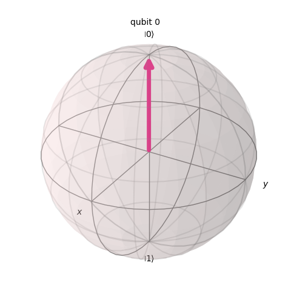
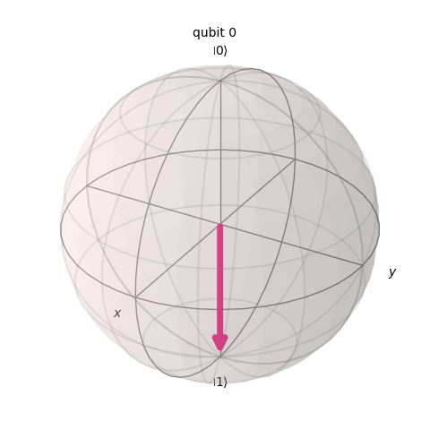
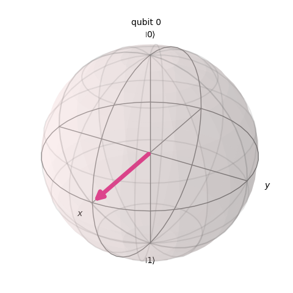
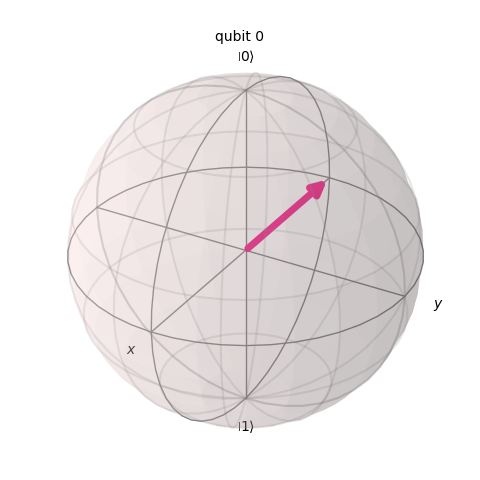

## Introduction

Sending secret messages is a key component of security. For as long as people have needed to keep secrets, we have needed ways to secure information. As governments and militaries got larger and more advanced, the risks of messages being stole became greater.

In modern times, we constantly send secret messages. Ever website you log into needs to keep your messages secret. Every credit card transaction or video chat needs to be secured from prying eyes.

The more important the information you need to secure is, the more effort you are willing to put into it. You might be willing to let a government supercomputer hack your Marvel Snap password. You might accept that they are able to, but you hope they don't care enough about you to do it. You absolutely don't want random hackers to get your password.

At the highest level of security, governments keep critical messages secure. Things like assassination instructions, locations of key CIA assets, or UFO wreckage reports. These messages don't just need to be secured from random hackers, other governments and very powerful organizations may want to get them.

Quantum Computers will introduce new levels of security to communications. In the short term, these methods will be extremely expensive. Those large business or government organizations that need maximum security will be willing to pay. In the long run, this will help us all get better security as hardware is improved and prices drop.

In this post, we will look at a simple **key distribution protocol** that can detect eavesdroppers using the laws of physics.

## Physics Basics

*This section covers some basic physics ideas needs to understand the protocol. It is recommended you read [this post](https://blog.boady.net/quantum_intro/) if you want a more comprehensive introduction.*

A quantum particle is one of the tiniest building blocks of our universe. These particles are governed by quantum physics instead of classical physics. Examples are electrons and photons. They exhibit someone called wave-particle duality.

When a quantum particle is measured, it looks like a classic particle. It seems like a physical thing. Once we measure it, we can measure it again and get the same answer.

When a quantum particle is traveling, it can act more like a wave. Imagine a wave in a pool. The wave is in multiple places at the same time. There is no one specific place the wave is at any time. This leads to a quantum property known as superposition. A quantum particle appears to be in many places at once until it is measured. At each place there is a probability that it will be measures there.

A photon is a single quantum particle of light. It can be polarized. When it is polarized in a horizontal or vertical way. We can then create a filter that will only allow photons of one polarization to pass by. Superposition allows a photon to have a 50% chance of passing by the filter and a 50% chance of being stopped. It is like the photon is both polarized and not polarized at the same time. If we look at the other side we will see what happened, this is called measurement. Until we measure it, the photon truly acts as if it is in both states. This forms one of the key features of quantum computers.

Photons have other properties that can be in superposition, for example their spin angular momentum. For quantum particle to be useful for a quantum computer, we need two properties that we can measure.  

## Qubit

In many fields of science it is important to abstract ideas. As humans it is hard to keep everything going on in our heads at once. Most computer programmers don't care about the electric signals on their processor. You can drive a car without understanding the makeup of the tires.

For quantum computing, we abstract the physical quantum particles as something called a **qubit**. A **qubit** represents the properties of the quantum particles we care about, but it models them in a way that is easier to image. Thinking about the polarization of a single photon is challenging for most people to imagine.

We imagine a qubit as a sphere. You can think of it as a ball. There are many questions we can ask about the ball, but only two matter for this protocol.

The qubit has a **computational basis**. This determines if the arrow is pointing up (0) or down (1).

The qubit can face the top which we call zero.

The qubit can face the bottom which we call one.

These are called the computational basis. If you only use these two options, you could replication the computations a classical computer does.

We can also point the arrow forward (+) and backwards (-).

This qubit is facing forward.

This qubit is facing backwards.

These are called phases.

| Basis | Representation | Meaning |
| ----- | -------------- | ------- |
| Computational Zero | $$\left\|0\right>$$ | Qubit facing up |
| Computational One | $$\left\|1\right>$$ | Qubit facing down |
| Phase Plus | $$\left\|+\right>$$ | Qubit facing forward |
| Phase Negative | $$\left\|-\right>$$ | Qubit facing backwards |

If we look for the correct thing, we can measure it. If we look for the wrong thing, we wil get a random answer.

Let's say you have a qubit pointing up.

You can ask two questions with obvious answers.

- Q: "Is the qubit pointing up?" A: "Yes"
- Q: "Is the qubit pointing down?" A: "No"

If you ask questions about forward and backwards, there is no obvious answer. The measurement sensor still needs to give a yes/no answer.

- Q: "Is the qubit pointing forward?" A: random 50% chance yes or no
- Q: "Is the qubit pointing backwards?" A: random 50% chance yes or no

The same thing happens with the phase. This qubit is facing backwards.

If you ask "is this facing forward", there is a definitive answer. If you as "is this facing up" you will get a random answer.

Our qubit can be in four positions. They are paired off. Either pair has one definitive answer and one 50/50 coin slip answer when you try and measure it.

This gives us most of the features we need for security. There is one more feature. You might think, why don't we just measure twice? Here the laws of physics will help us. If you measure under the phase basis and get an answer, you will always get that answer again! The act of measuring a quantum particle changes its state!

Let's say we measure this particle which is pointing up in the phase basis.

If the phase measurement reads "forward" the qubit will be in the forward state any always read forward from this point onward. The superposition was broken.

Now, we cannot measure the computation basis, since measuring in the phase basis changed the qubit.

This should lead you to another question. We cannot measure the qubit twice. Let's make a copy! We can measure one in the phase basis and one in the computation basis.

The laws of quantum physics also protect us here! We cannot make a copy without measuring the original, which breaks superposition again!

This leaves us with the key to detecting eavesdroppers. Measuring a traveling qubit in any way will leave some evidence.

## Secret Key Messages

I want to send a secret message to my friend. The secret message is "foom". In a computer, each letter has a related number. These were originally the [ASCII codes](https://www.asciitable.com), but we now use [Unicode](https://home.unicode.org). The modern unicode standard uses the same numbers for all the basic letters, but adds things like emoji and international characters. For this example, we are only using letters that are the same in both.

Each letter in our message has a number that represents it. In a computer, this letter is stored in [binary](https://www.mathsisfun.com/binary-number-system.html). The below table shows our message in all three ways.

| Letter | Number | Binary |
| ------ | ------ | ------ |
| f | 102 | 01100110 |
| o | 111 | 01101111 |
| o | 111 | 01101111 |
| m | 109 | 01101101 |

These codes are common knowledge. If I send a message encoded like this, anyone with basic computer science knowledge can read it. I want to come up with a way to store letters which will allow the target of the message to read it but no one else.

If I could someone put the message in an envelope and drop it off in person, that would be super secure! In real life, we often send our messages over the internet. We don't know exactly who might be looking at them as they travel to their destination. Even if we mailed a letter, it is possible someone could open it and reseal the envelope.

One of the easiest ways to secure a message is to make a **key**. Anyone with the key can decode the message. Anyone without the key will fail.

One very simple key encoding method is called XOR. Here is an 8-bit key.

$$10101100$$

When you XOR two binary numbers you do the following:

- When the bits are the same put a 0
- When the bits are different put a 1

We can XOR the letters in "foom".

$$01100110 \oplus  10101100 = 11001010$$
$$01101111 \oplus  10101100 = 11000011$$
$$01101111 \oplus  10101100 = 11000011$$
$$01101101 \oplus  10101100 = 11000001$$

The new binary values should look like nonsense to anyone reading our message. I send them across the internet and I am not worried if people look at them. They will look like nonsense letters.

The person I am sending my message two has the key. They use the key to decode the message back to the correct numbers.

$$11001010 \oplus  10101100 = 01100110$$
$$11000011 \oplus  10101100 = 01101111$$
$$11000011 \oplus  10101100 = 01101111$$
$$11000001 \oplus  10101100 = 01101101$$

As long as only my target has the key, they are the only ones who can recover the secret message. They know now to unlock the vault.

There are a few problems with this example. First, notice that both "o" characters encode to the same number. This might be noticed by an eavesdropper. This can help them guess the key. We can solve this by using much longer keys. A key with 80 bits (encoding 10 letters at once) would be much harder to find patterns in. Secondly, there are only 256 8-bit keys possible. Your iphone could test them all in under a second. Again, this can be solved with bigger keys. An 80-bit key has 1,208,925,819,614,629,174,706,176 possible values. That is harder to solve by trial an error. Actually, we can easily use keys that are thousands of bits long if we need to.

By just increasing the key size we can solve all but one big issue. How do we keep the key secret? If we send it over the internet and someone copies it our whole plan falls apart. We could print it on a piece of paper and hand it to you, but that might not scale well. I don't think you want to drive to the main office of every website you use. Also, if you carry those papers around someone could take a picture. We are left with one big problem. Getting both sides of the message to have the key without anyone knowing it.

This is the part of the protocol qubits can fix! We cannot stop people from looking at messages sent in public. What we can do, it create a situation were we can detect if someone eavesdrops on our key. They we know it is not safe to use.

## BB84 Protocol

We have to people who want to send a secret message Alice and Bob. They are worried an eavesdropper (Eve) will steal their key. They have to communicate over a public internet channel. (We could run a special phone line just for them, but that might create other problems!)

The first thing they need to do is exchange a key. If they can do that secretly, then they can send encoded messages over the public internet channel. The BB84 protocol gives them a way to do this an detect Eve.

First, we will look at it with no eavesdropping at all. Remember, the key itself doesn't need to be anything specific. It just needs to be a binary number that Alice and Bob know but no one else does. The real messages will be sent later using this key.

Alice says openly to Bob that she is going to start sending the key. She doesn't care if anyone else hears this. She sends him 200 qubits following the same pattern.

- Alice flips a coin: heads means computation basis and tails means phase basis.
- Alice flips another coin: heads means $\left|0\right>$ or $\left|+\right>$ (depending on previous flip). Tails means $\left|1\right>$ or $\left|-\right>$.

Alice sends the qubit over the network channel. Bob gets is. He flips his own coins.

- On heads, he measures the computational basis
- On tails, he measures the phase basis

He it trying to figure out if Alice flips heads (0) or tails (1) on her second flip each time. Here is a example with a few qubits. It shows all the possible outcomes.

| Alice Flip 1 | Alice Flip 2 | Qubit Sent | Bob Flip 1 | Bob Measurement |
| ---- | ---- | ---- | --- | ---- |
| H | T | $\left\|1\right>$ | H | 1 (100% chance) |
| H | H | $\left\|0\right>$ | H | 0 (100% chance) |
| T | H | $\left\|+\right>$ | H | 0 (50% chance) or 1 (50% chance) |
| T | T | $\left\|-\right>$ | H | 0 (50% chance) or 1 (50% chance) |
| H | T | $\left\|1\right>$ | T | 0 (50% chance) or 1 (50% chance) |
| H | H | $\left\|0\right>$ | T | 0 (50% chance) or 1 (50% chance) |
| T | H | $\left\|+\right>$ | T | 0 (100% chance) |
| T | T | $\left\|-\right>$ | T | 1 (100% chance) |

When Alice and Bob's coin flips match, they measure in the same basis and always get the right answers. When their coin flips are different, Bob gets a random answer. They need to sync up their data.

Alice says over the public channel "I am done sending qubits to you." Then she reports her first coin flips "HHTTHHTT". Bob gets those messages and writes back "I did "HHHHTTTT". Alice and Bob can now match up the qubits they both measured the same way. The ones where they picked different answers are nonsense and discarded.

There is a 50% chance Bob will flip the same value as Alice, so about half the qubits will make it safely. We can always overestimate. For example, if we want at least an 80-bit key, we can send 300 qubits just to be sure at least 80 will get lucky and make it. Once the qubits arrive, we don't care if anyone knows the coin flips. We just needed to keep them secret until they arrived. The reason will be explained in the next section.

Alice and Bob now do one extra step to detect eavesdroppers. They share the first few bits that matched, normally about 10%. These won't be used in the key. Again, we can always send extra qubits. Remember a qubit is something like a single photon. We can afford to send a lot, they travel at the speed of light.

If no eavesdropping is detected, Alice and Bob have a shared key that none one else knows. If eavesdropping is detected, the channel is not secure and Alice cuts off communication. They cannot risk sending a secret message with an unsecure key.

## Eavesdropping

What happens when Eve tries to steal the key. Eve cannot copy the qubits without measuring them. This is called the no-cloning principle. So, she has to measure they as they pass by her on the way to Bob. Just like Bob, she has to guess what the original coin flip was. Eve has no way of knowing if she should measure phase or computational basis. If she picks wrong, she will get a random answer.

Once more thing is at risk if Eve picks wrong. If Alice sends in the computational basis and Eve measures in the phase basis that will change the qubit. Once it reaches Bob it will be different. Should Bob guess correctly (computational basis) he will get a wrong answer 50% of the time.

Let's look at how the three players in our story can measure the qubits. We will use C for computational and P for Phase.

| Alice | Eve | Bob | Result |
| ----- | --- | --- | ---- |
| C | C | C | Eve is undetected and qubit is usable |
| C | C | P | Qubit is unusable because Bob guessed wrong |
| C | P | C | Eve has a 50% chance of being detected |
| C | P | P | Qubit is unusable because Bob guessed wrong |
| P | C | C | Qubit is unusable because Bob guessed wrong |
| P | C | P | Eve has a 50% chance of being detected |
| P | P | C | Qubit is unusable because Bob guessed wrong |
| P | P | P | Eve is undetected and qubit is usable |

There are some situations where Eve can eavesdrop undetected. There are some situations where the qubit is discarded. There are some situations where Eve might cause a problem.

What are the chances Eve goes undetected? In reality they are so low that it will be impossible.

Let's imagine Alice originally sends 300 qubits. About half the time Bob will guess correctly. Imagine that 135 times Alice and Bob guess the same thing. In real life, if you flip a coin 100 times, you probably won't get heads exactly 50 times. It is just that on every flip there is a 50% chance of heads. The more flips you make the closer you get to 50/50.

On those 135 qubits, Eve needs to either guess correctly or get lucky and have the random 1/0 answer be right by chance. What could happen.

| Eve Guess | Qubit Action |
| ------- | -------- |
| Same as Bob | Bob gets right answer |
| Different and Bob | Bob might get the wrong answer 50% of the time |

Eve has a 50% chance of guessing correctly. To guess all 135 qubits correctly, she has a 1 in 43,556,142,965,880,123,323,311,949,751,266,331,066,368 chance. That is about $4.3 * 10^{40}$. A rough estimate of the number of atoms in the human body is $7*10^{27}$ (Helmenstine). It would be easier for two people to guess the same atom in their body that for Eve to guess every coin flip correctly.

We can safely assume she will make some mistakes. Every mistake she makes will have a 50% chance of being detected. Imagine she only makes 10 total mistakes. The changes she will be detected are 1023 in 1024 (99.9%). If she makes 20 mistakes the chance she will be detected increases to 99.9999%.

This protocol isn't perfect. There is a tiny chance that Eve can go undetected, but it is extremely small and the more qubits the smaller it gets. With enough qubits, the chances of Eve going undetected will be greater than the chance of two people guessing the same atom out of ever one in the entire universe.

This is a level of security we cannot get from classical computing. Quantum computing allows for sometimes entirely new and exciting. The very laws of quantum physics help up detect an eavesdropper!

## Summary

The BB84 protocol is one of the most straightforward quantum security protocols. A simplified version BB92 was successfully used to send a key 200 meters (Mishra et al). Now, 200 meters isn't very far, but these protocols are being implemented. As our understanding of quantum physics and hardware development improve these protocols will get better. It is likely government and military organizations will be the first to put them into practice (if they haven't already). These will be some of the first practical uses of quantum computers.

Classical encryption methods rely on levels of security. There are always ways to break them, but those methods take time. The more higher the classical security is, the longer it takes to crack. You might use a one-time password that can be cracked in a year, but no one will care about the answer in a year.

Which quantum encryption methods, we take advantage of the basic laws of physics. Things that cannot be circumvented without finding flaws in our understanding of how the universe works. No matter how fast or powerful you make your computer, it will not bend the laws of physics. This provides a basis for a whole new type of security for transmitting secret messages.

## References

Brody, J. (2025). The joy of quantum computing a concise introduction. Princeton University Press.

Haitjema, M. (n.d.). A survey of the prominent quantum key distribution protocols. Quantum Key Distribution - QKD. https://www.cse.wustl.edu/~jain/cse571-07/quantum.htm

Helmenstine, Anne Marie. How Many Atoms Are in the Human Body? ThoughtCo. https://www.thoughtco.com/how-many-atoms-are-in-human-body-603872

Mishra, S., Biswas, A.K., Patil, S., Chandravanshi, P., Mongia, V., Sharma, T., Rani, A., Prabhakar, S., Ramachandran, S., & Singh, R.P. (2021). BBM92 quantum key distribution over a free space dusty channel of 200 meters. Journal of Optics, 24.

Nielsen, M. A., & Chuang, I. L. (2010). Quantum Computation and Quantum information Michael A. Nielsen & Isaak L. Chuang. Cambridge Univ. Press.
